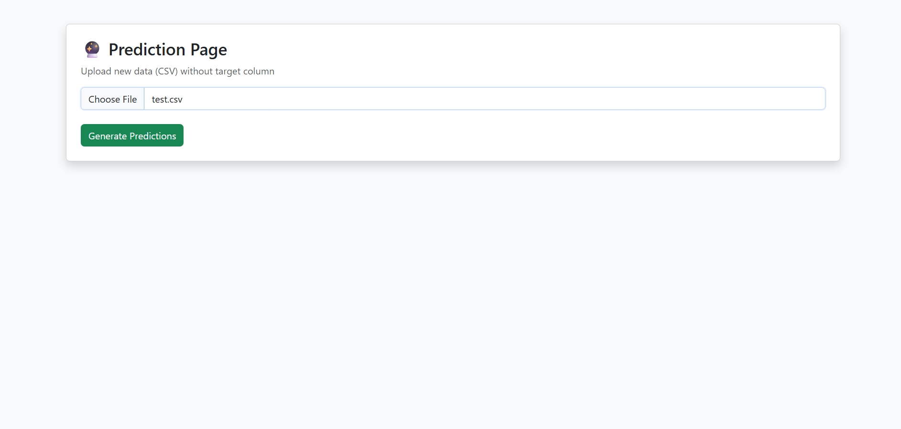

# data2model Django Web Application

An end-to-end Auto ML web application built with Django and scikit-learn.
The system automates data preprocessing, model training, evaluation, interpretability, and prediction for tabular datasets, providing a complete machine learning workflow through a web interface.

## Features

* Upload CSV datasets
* Automatic task detection (Classification / Regression)
* Automated preprocessing (scaling, encoding, imputation)
* Auto ML model training and comparison
* Best model selection
* Confusion matrix and feature importance visualization
* Column-level interpretability
* Prediction on new datasets
* Download trained ML model (.pkl)
* Model versioning and metadata

## Tech Stack

* Python
* Django
* scikit-learn
* Pandas, NumPy
* Matplotlib

## Project Structure


data2model/

│── automl\_project/

│── venv/ (ignored)

│── requirements.txt

│── README.md

│── .gitignore


## Screenshots


### Dataset Upload


### Target Feature selection


### Result


### Test Prediction


### Prediction Preview


How to Run Locally


```bash

git clone https://github.com/YOUR\_USERNAME/automl-django-app.git

cd data2model


python -m venv

venv\Scripts\activate


pip install -r requirements.txt

cd automl_project

python manage.py migrate

python manage.py runserver


