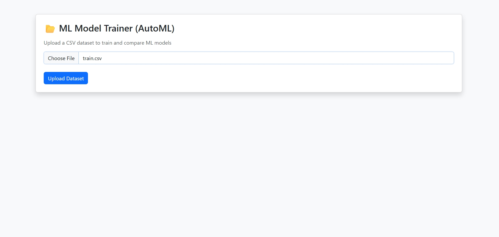
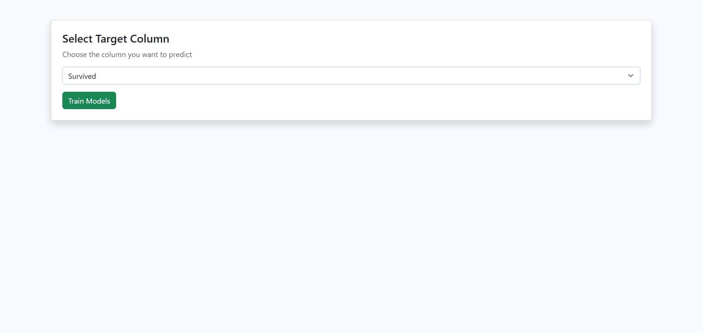
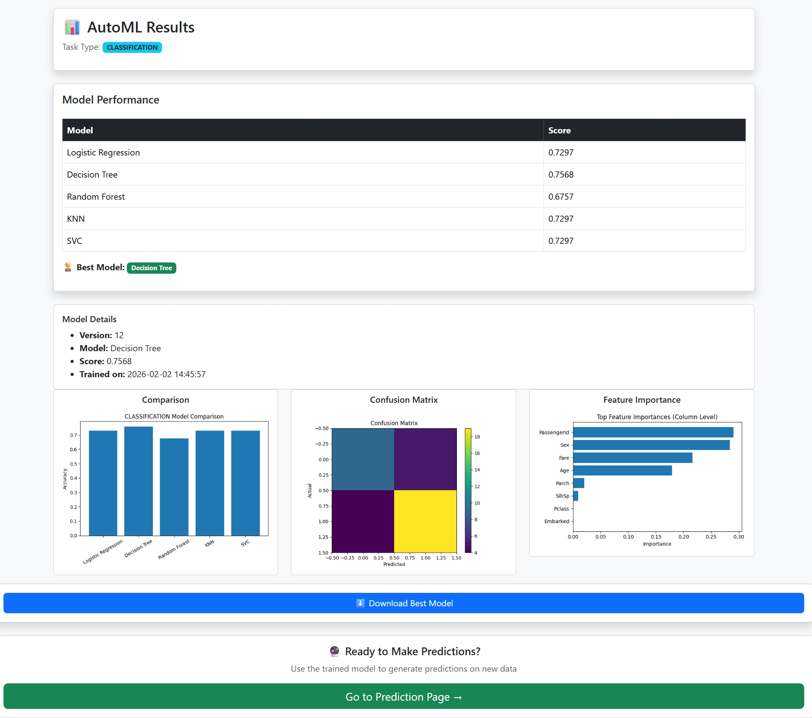
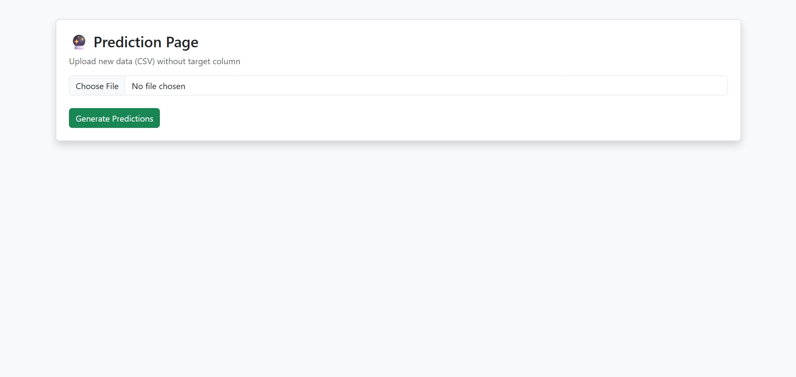
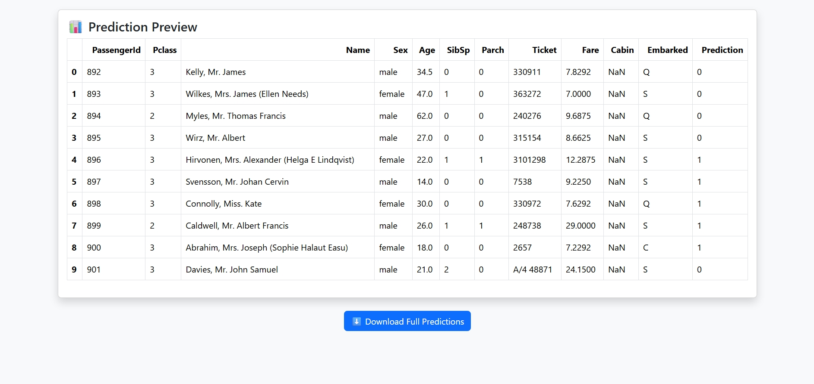

# AutoML Django Web Application

An end-to-end AutoML web application built using Django and scikit-learn.  
This project allows users to upload tabular CSV datasets, automatically train multiple machine learning models, compare performance, interpret results, and generate predictions.

## 🚀 Features

* Upload CSV datasets
* Automatic task detection (Classification / Regression)
* Automated preprocessing (scaling, encoding, imputation)
* AutoML model training and comparison
* Best model selection
* Confusion matrix and feature importance visualization
* Column-level interpretability
* Prediction on new datasets
* Download trained ML model (.pkl)
* Model versioning and metadata

## 🛠 Tech Stack

* Python
* Django
* scikit-learn
* Pandas, NumPy
* Matplotlib

## 📂 Project Structure


automl\_web\_app/

│── automl\_project/

│── venv/ (ignored)

│── requirements.txt

│── README.md

│── .gitignore


## 📸 Screenshots

### Index Page


### Dataset Upload



### Target Feature selection



### Result



### Prediction Index


### Prediction Preview



How to Run Locally


```bash

git clone https://github.com/YOUR\_USERNAME/automl-django-app.git

cd automl-django-app


python -m venv venv

venv\\Scripts\\activate


pip install -r requirements.txt

cd automl\_project

python manage.py migrate

python manage.py runserver


